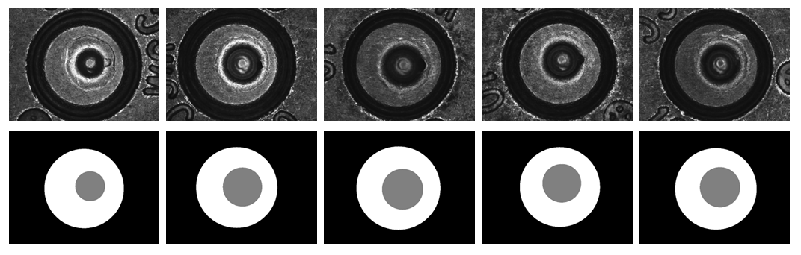

# Cartridge Case -Segmentation
In this work, we proposed cartridge case segmentation using UNet [1], Dense UNet [2-5], and DeepLabv3+ [6] with the high-resolution NIST dataset [7]. The sample images are shown below.

---

## About the Model
This model is inspired by . We adapted the code for three-class segmentation involving breech face, firing pin, and background. The model parameters can be found in configs/segmentation_config.json.

---

### Model Training

Set the paths to the training, validation, and testing images and their corresponding ground truth masks in configs/utils/config_utils.py.
Then, run main_train.py to train the model.
The NIST dataset and its ground truth annotations are available at the following link.

[NIST dataset](https://discovery.dundee.ac.uk/en/datasets/segmentation-masks-for-breech-and-firing-pin-areas-for-a-nist-dat)

---

### Trained Models

The model is trained on the NIST dataset, and the trained model can be found at the following link:

Trained Models: You can download [here](https://github.com/LRCFS/Cartridge-Case-Segmentation/tree/main/Pre-trained%20Models)

To test your own image, place the image in the Testing-Codes/experiments/Deeplab/test/imgs directory, and place the HDF5 files in the Testing-Codes/hdf5 directory. Additionally, adjust the patch_size and stride values in the segmentation_config.json file to match your image size.

---

### Required Packages

The required packages are listed in CC-Segmentation/ccgpu.yml.

---

### References

If you use this code or model in your research, please cite:

[1] @inproceedings{ronneberger2015u,
  title={U-net: Convolutional networks for biomedical image segmentation},
  author={Ronneberger, Olaf and Fischer, Philipp and Brox, Thomas},
  booktitle={Medical image computing and computer-assisted intervention--MICCAI 2015: 18th international conference, Munich, Germany, October 5-9, 2015, proceedings, part III 18},
  pages={234--241},
  year={2015},
  organization={Springer}
}

[2] @article{wang2019dense,
  title={Dense U-net based on patch-based learning for retinal vessel segmentation},
  author={Wang, Chang and Zhao, Zongya and Ren, Qiongqiong and Xu, Yongtao and Yu, Yi},
  journal={Entropy},
  volume={21},
  number={2},
  pages={168},
  year={2019},
  publisher={MDPI}
}

[3] @article{yao20223d,
  title={3D-FVS: construction and application of three-dimensional fundus vascular structure model based on single image},
  author={Yao, Zhaomin and Luo, Renli and Xing, Chencong and Li, Fei and Zhu, Gancheng and Wang, Zhiguo and Zhang, Guoxu},
  year={2022}
}

[4] @article{mookiah2021quantitative,
  title={On the quantitative effects of compression of retinal fundus images on morphometric vascular measurements in VAMPIRE},
  author={Mookiah, Muthu Rama Krishnan and Hogg, Stephen and MacGillivray, Tom and Trucco, Emanuele},
  journal={Computer methods and programs in biomedicine},
  volume={202},
  pages={105969},
  year={2021},
  publisher={Elsevier}
}

[5] @misc{Optic-Disc-Unet, 
  author = {Karl Xing, Darío Hereñú}, 
  title = {Optic-Disc-Unet}, 
  year = {2018}, 
  publisher = {GitHub}, 
  journal = {GitHub repository}, 
  howpublished = {\url{https://github.com/DeepTrial/Optic-Disc-Unet}}, 
  commit = {488a3cd} 
} 

[6] @article{chen2017deeplab,
  title={Deeplab: Semantic image segmentation with deep convolutional nets, atrous convolution, and fully connected crfs},
  author={Chen, Liang-Chieh and Papandreou, George and Kokkinos, Iasonas and Murphy, Kevin and Yuille, Alan L},
  journal={IEEE transactions on pattern analysis and machine intelligence},
  volume={40},
  number={4},
  pages={834--848},
  year={2017},
  publisher={IEEE}
}

[7] @article{hare2017automatic,
  title={Automatic matching of bullet land impressions},
  author={Hare, Eric and Hofmann, Heike and Carriquiry, Alicia},
  journal={The Annals of Applied Statistics},
  pages={2332--2356},
  year={2017},
  publisher={JSTOR}
}

